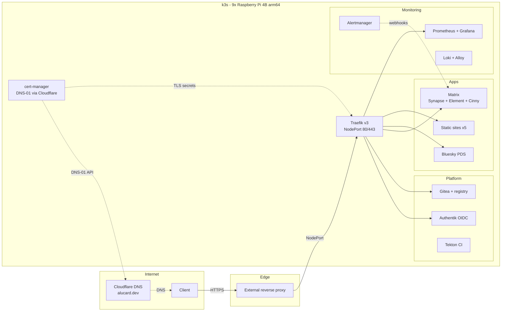
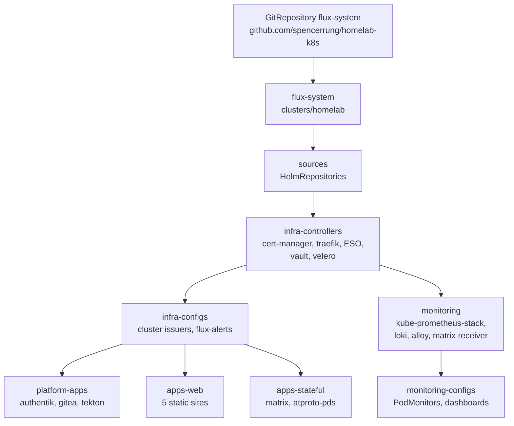
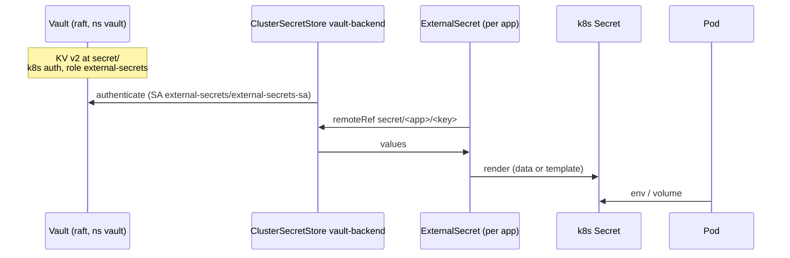

# Architecture

GitOps layer for a 9-node Raspberry Pi 4B k3s cluster (6×8GB, 1×4GB,
2×2GB, arm64). A separate ansible repo installs the OS and k3s; everything
after that reconciles from this repo via Flux.

## Traffic

- Traefik is deliberately **NodePort**, not LoadBalancer: bare metal, no
  MetalLB; an external reverse proxy fronts the cluster and Cloudflare
  fronts public hostnames.
- Certificates are DNS-01 (Cloudflare API token via Vault/ESO), so no
  inbound HTTP challenge path is needed.

## Flux reconciliation graph

Rules of the graph:

- **Update this diagram in the same PR as any new `clusters/homelab/*.yaml`.**
- `infra-controllers` and `platform-apps` use `wait: false` + explicit
  HelmRelease `healthChecks`, so one slow chart doesn't block the tier.
- CRD *instances* must not share a Kustomization with the HelmRelease that
  installs their CRDs (Flux dry-runs everything before applying) — that's
  why `monitoring-configs` exists.
- Reconciliation failures alert to the Matrix **Homelab Alerts** room
  (`infrastructure/base/flux-alerts/`). The Alert lists HelmReleases per
  namespace — add an entry when a new namespace gains one.

## Secrets

- Vault runs **production mode, single-node raft** on a local-path PVC
  pinned to `pi-03`. A pod restart leaves it **sealed**: workloads keep
  running on rendered k8s Secrets, ESO refreshes resume after
  `VAULT_UNSEAL_KEY=... bootstrap/vault-init.sh`.
- One ClusterSecretStore serves every namespace; the Vault k8s-auth role
  binds only `external-secrets/external-secrets-sa`.
- Nothing secret lives in git. Blueprints/configs that embed secrets are
  rendered by ExternalSecret templates or `${ENV}` expansion.

## Storage & backup

| Data | Where | Protected by |
|---|---|---|
| Vault (all secrets) | raft PVC on pi-03 | nightly raft snapshot → B2 (30d) |
| Matrix postgres + synapse media/signing key | local-path PVCs | Velero nightly (14d) + pg_dump hook; signing key also in Vault |
| Bluesky PDS sqlite + blobs | local-path PVC | Velero nightly (14d) |
| Gitea repos + postgres, Authentik postgres | local-path PVCs | Velero nightly (14d) + pg_dump hooks |
| Everything declarative | git | GitHub |

local-path storage is node-local: stateful pods are effectively pinned to
the node holding their data. Recovery: [runbooks/disaster-recovery.md](runbooks/disaster-recovery.md).

## Monitoring

kube-prometheus-stack (trimmed for k3s — no scheduler/controller-manager/
kube-proxy/etcd scrapes), Loki single-binary + Alloy DaemonSet for logs,
Grafana at `grafana.alucard.dev`. Alertmanager and Flux both notify the
Matrix **Homelab Alerts** room via the `@alertmanager` bot. See
[runbooks/monitoring.md](runbooks/monitoring.md).

## CI

Tekton builds app images in-cluster (kaniko) on Gitea pushes. Image
promotion into deployments is being moved to Flux image automation
(sortable tags → Docker Hub → ImagePolicy commits back to this repo).
